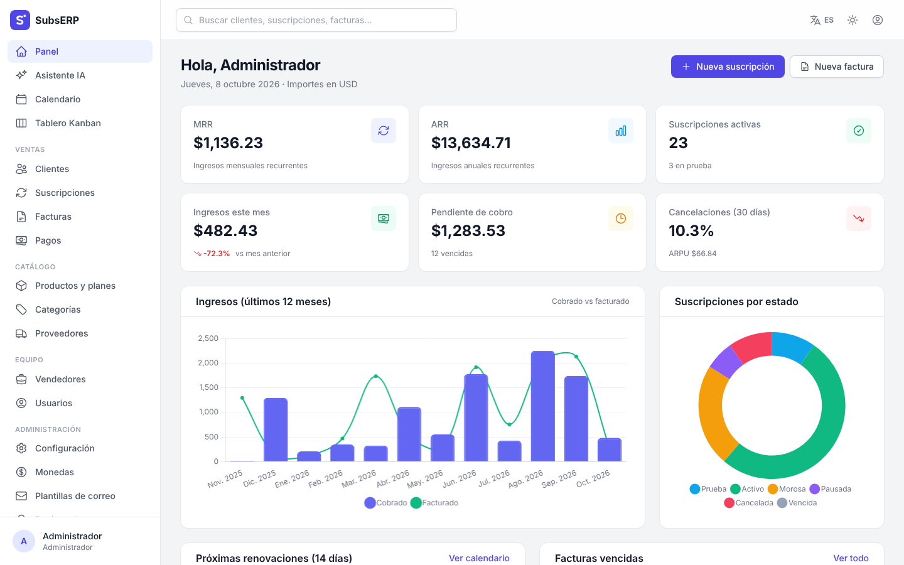
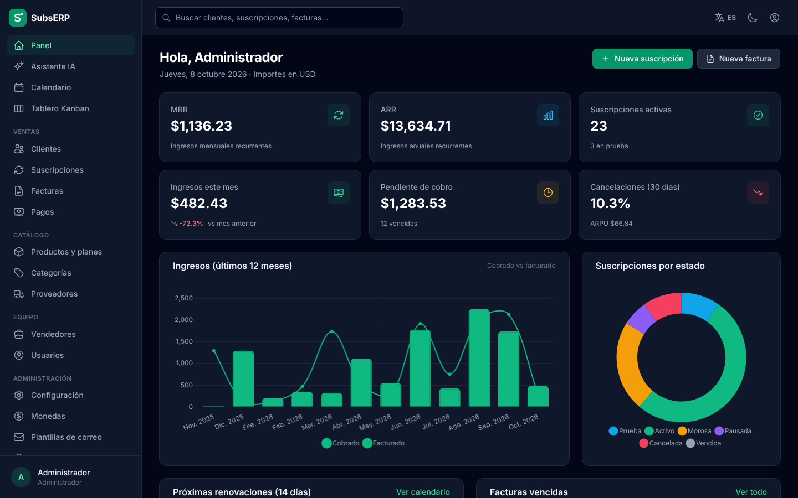
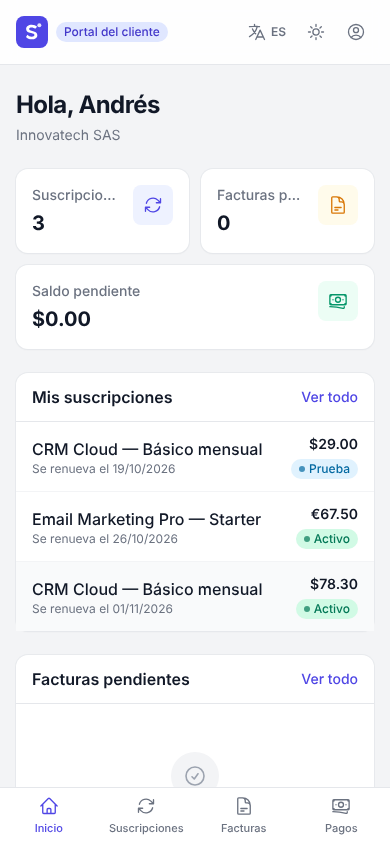
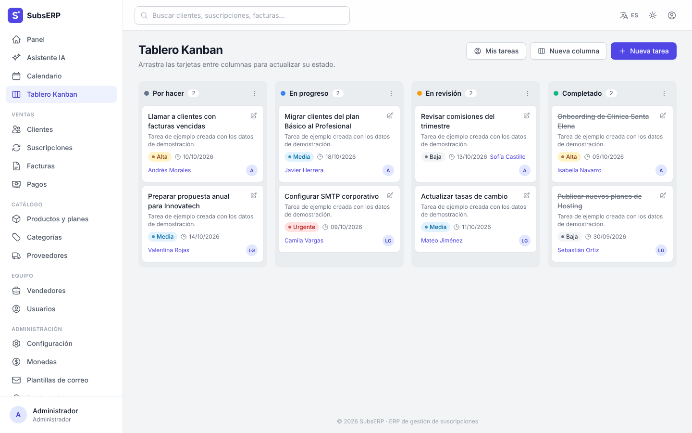
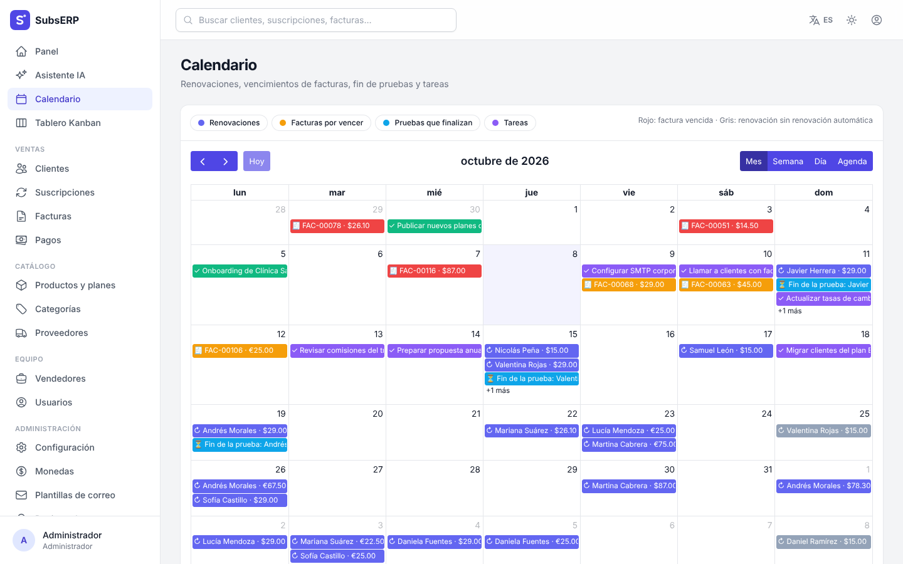
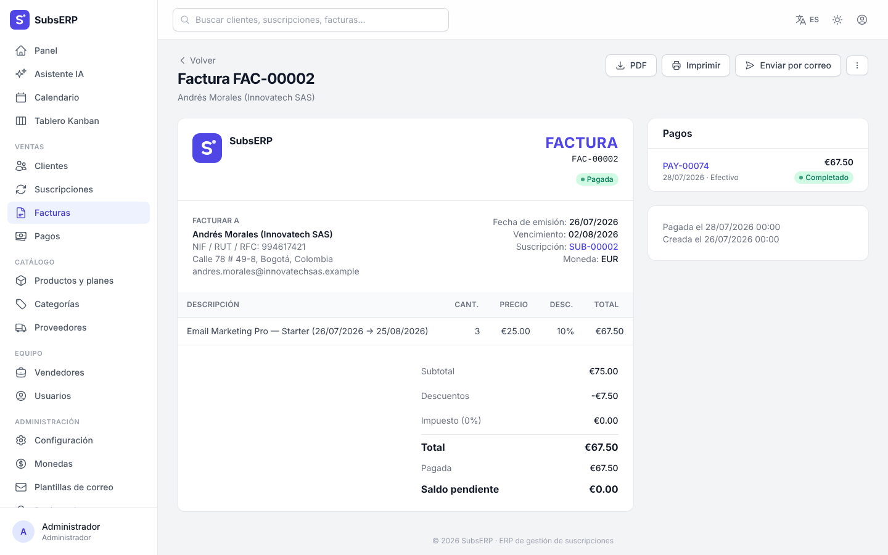
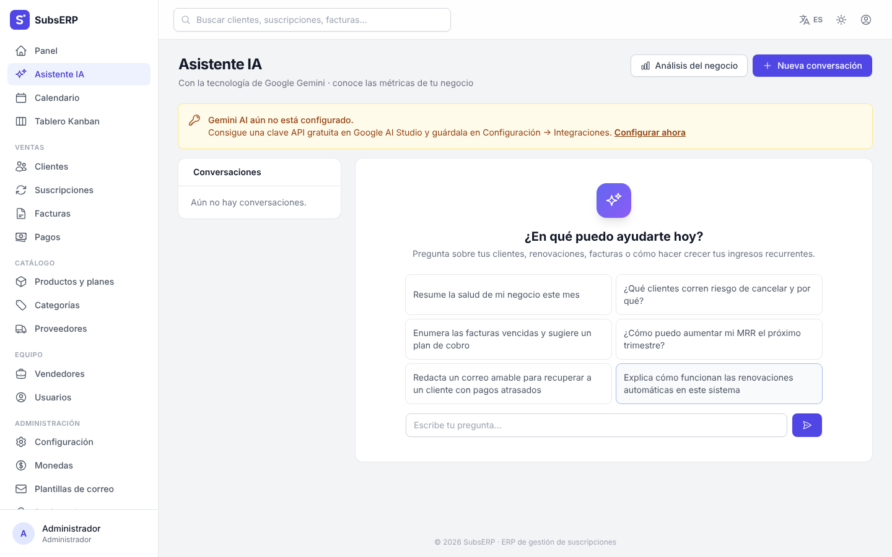

# SubsERP · Sistema de gestión de suscripciones

ERP completo para negocios de suscripción construido con **PHP 8.2+, Laravel 12, SQLite, Laravel Breeze y Google Gemini AI**.
Gestiona clientes, planes, renovaciones automáticas, facturación recurrente, cobros, recordatorios por correo, vendedores, proveedores y un portal de autoservicio para tus clientes, con un asistente de IA que conoce las métricas de tu negocio.



## Características

| | Módulo | Qué incluye |
|---|---|---|
| ✅ | **Gestión de suscripciones** | Altas con periodo de prueba, cantidad/licencias, descuentos, pausa, reanudación, cancelación inmediata o al final del periodo, historial de renovaciones. |
| ✅ | **Asistente de chat Gemini AI** | Conversaciones con memoria, contexto real del negocio (MRR, morosidad, renovaciones…), análisis ejecutivo por enfoque (churn, ingresos, precios, ventas), análisis de riesgo por cliente y redacción de plantillas de correo. |
| ✅ | **Motor de facturación recurrente** | `billing:run` genera las facturas de cada periodo, recupera periodos atrasados, convierte pruebas en suscripciones activas, expira las que no se renuevan y marca facturas vencidas/suscripciones morosas. |
| ✅ | **Tablero Kanban** | Columnas configurables, tareas con prioridad, responsable, cliente y vencimiento; arrastrar y soltar (también en móvil). |
| ✅ | **Vista de calendario completa** | Mes, semana, día y agenda (FullCalendar) con renovaciones, vencimientos de facturas, fin de pruebas y tareas, con filtros por tipo. |
| ✅ | **Portal del cliente** | Suscripciones, facturas (PDF), pagos, activar/desactivar la renovación automática y solicitar la cancelación. |
| ✅ | **Soporte para múltiples monedas** | Monedas con tasa de cambio, moneda base intercambiable (recalcula tasas) y reportes convertidos a la moneda base. |
| ✅ | **Generador de facturas** | Editor con líneas dinámicas, productos del catálogo, descuentos por línea, impuestos, PDF (DomPDF), impresión, duplicado, anulación y envío por correo. |
| ✅ | **Seguimiento de pagos** | Pagos parciales o totales, métodos de pago, estados, recibos por correo; el estado de la factura y de la suscripción se actualiza solo. |
| ✅ | **Sistema de renovación automática** | Cada suscripción con renovación automática genera su factura al inicio del periodo; sin ella, expira al finalizarlo. |
| ✅ | **Recordatorio por correo electrónico (cron)** | `reminders:send` avisa N días antes de la renovación (p. ej. 7,3,1) y repite avisos de facturas vencidas; sin duplicados y con registro de envíos. |
| ✅ | **Configuración SMTP** | Servidor, puerto, cifrado, remitente y contraseña cifrada desde la interfaz, con botón de correo de prueba. |
| ✅ | **Inicio de sesión con Google OAuth** | Laravel Socialite; credenciales desde la interfaz y alta automática opcional de clientes. |
| ✅ | **Módulo de vendedores** | Comisiones, metas mensuales, acceso propio con datos restringidos a su cartera y panel “Mis comisiones”. |
| ✅ | **Gestión de proveedores** | Proveedores vinculados a productos y coste estimado por periodo. |
| ✅ | **Catálogo de productos** | Productos, categorías y planes de precio (diario, semanal, mensual, trimestral, semestral, anual, cada N periodos, prueba y cuota de alta). |
| ✅ | **Creación de campos personalizados** | Texto, número, fecha, correo, URL, lista, casilla… para clientes, suscripciones, facturas, productos, proveedores y vendedores; con validación y columnas opcionales en los listados. |
| ✅ | **Copias de seguridad y restauración** | Copia consistente de SQLite (`VACUUM INTO`), descarga, restauración (con copia previa de seguridad), subida de archivos y copia diaria automática con retención. |
| ✅ | **Modo de mantenimiento** | Activable desde la configuración con mensaje personalizado; los administradores siguen trabajando. |
| ✅ | **Asistente de configuración** | Instalador web en 3 pasos: requisitos, base de datos (con datos demo opcionales) y empresa + administrador. |
| ✅ | **Temas de modo oscuro** | Claro / oscuro / sistema, 7 colores de acento y 4 temas oscuros (Clásico, Medianoche, Carbón, Moca), guardados por usuario. |
| ✅ | **Soporte para varios idiomas** | Español, inglés y portugués (interfaz, validaciones, plantillas de correo y calendario). |
| ✅ | **Interfaz adaptable a móviles** | Tailwind CSS: menú lateral desplegable, tablas desplazables y navegación inferior en el portal. |
| ✅ | **Aplicación web progresiva (PWA)** | Manifiesto, iconos, *service worker* con página sin conexión y botón “Instalar aplicación”. |

Además: panel con MRR, ARR, ARPU, churn, ingresos de 12 meses y renovaciones próximas; búsqueda global; registro de actividad (auditoría); registro de correos; roles (administrador, personal, vendedor, cliente).

| Modo oscuro “Medianoche” | Portal del cliente (móvil) |
|---|---|
|  |  |

| Kanban | Calendario |
|---|---|
|  |  |

| Factura | Asistente IA |
|---|---|
|  |  |

## Requisitos

- PHP **8.2 o superior** con las extensiones `pdo_sqlite`, `sqlite3`, `mbstring`, `openssl`, `xml`, `curl`, `fileinfo`, `gd` e `intl`.
- Composer 2.
- Node.js 18+ y npm (solo para compilar los recursos front-end).
- No necesitas servidor de base de datos: se usa **SQLite**.

## Instalación

```bash
git clone https://github.com/hamstersoftwarecol/Sistema-de-gesti-n-de-suscripciones-.git subserp
cd subserp
composer run setup        # dependencias, .env, APP_KEY, archivo SQLite y compilación de assets
php artisan serve
```

Abre `http://localhost:8000`: el **asistente de configuración** te guiará para crear la base de datos (con datos de demostración opcionales), tu empresa y la cuenta de administrador.

### Instalación con datos de demostración (sin asistente)

```bash
composer run demo         # = php artisan migrate:fresh --seed
```

| Rol | Correo | Contraseña |
|---|---|---|
| Administrador | `admin@demo.com` | `password` |
| Personal | `staff@demo.com` | `password` |
| Vendedor | `seller@demo.com` | `password` |
| Cliente (portal) | `cliente@demo.com` | `password` |

> Cambia estas contraseñas o elimina los usuarios demo antes de usar el sistema en producción.

### Producción

```bash
composer install --no-dev --optimize-autoloader
npm ci && npm run build
php artisan config:cache && php artisan route:cache && php artisan view:cache
```

Apunta el *document root* del servidor web a la carpeta `public/` y asegúrate de que `storage/`, `bootstrap/cache/` y `database/` tengan permisos de escritura. Establece `APP_ENV=production`, `APP_DEBUG=false` y `APP_URL` en `.env`.

## Tareas programadas (cron)

El motor de facturación y los recordatorios se ejecutan una vez al día. Configura **una** de estas opciones:

1. **Crontab del servidor (recomendado):**
   ```cron
   * * * * * cd /ruta/al/proyecto && php artisan schedule:run >> /dev/null 2>&1
   ```
   | Comando | Horario | Qué hace |
   |---|---|---|
   | `billing:run` | 00:30 | Renueva suscripciones, emite facturas, expira planes, marca vencidas |
   | `reminders:send` | 09:00 | Recordatorios de renovación y avisos de facturas vencidas |
   | `backup:create --prune` | 02:00 | Copia diaria (si está activada en Configuración → Mantenimiento) |

2. **Cron web** para hosting compartido: en *Configuración → Recordatorios y cron* encontrarás una URL secreta (`/cron/{token}`) para llamarla una vez al día desde un servicio externo (p. ej. cron-job.org).

Ambos comandos aceptan `--date=AAAA-MM-DD` para simular un día concreto. También puedes ejecutarlos desde la interfaz con el botón **Ejecutar ahora**.

## Configuración

Todo se configura desde **Configuración** (solo administradores), sin editar archivos:

- **General:** nombre, datos fiscales, idioma predeterminado, zona horaria, formato de fecha, apariencia por defecto y registro público.
- **Facturación:** prefijo y numeración, plazo de pago, impuesto por defecto, notas/términos, envío automático de facturas y marcado de morosidad.
- **Recordatorios y cron:** días de aviso antes de la renovación, intervalo de avisos de facturas vencidas, URL de cron web.
- **Correo (SMTP):** servidor, puerto, cifrado, usuario, contraseña (guardada cifrada) y remitente, con correo de prueba.
- **Integraciones:**
  - **Gemini AI:** crea una clave gratuita en [Google AI Studio](https://aistudio.google.com/apikey) y elige el modelo (por defecto `gemini-2.5-flash`). También puedes usar `GEMINI_API_KEY` en `.env`.
  - **Google OAuth:** crea credenciales OAuth en Google Cloud Console y registra la URI de redirección que muestra la pantalla (`https://tu-dominio/auth/google/callback`).
- **Mantenimiento:** modo mantenimiento con mensaje y copias de seguridad automáticas.

Las claves secretas (SMTP, Gemini, Google) se guardan cifradas con `APP_KEY`; si cambias la `APP_KEY` tendrás que volver a introducirlas.

## Roles y permisos

| Rol | Acceso |
|---|---|
| **Administrador** | Todo, incluidos configuración, usuarios, plantillas, campos personalizados, copias de seguridad y auditoría. |
| **Personal** | Clientes, suscripciones, facturación, pagos, catálogo, proveedores, vendedores, monedas, IA, Kanban y calendario. |
| **Vendedor** | Solo sus clientes, suscripciones, facturas y pagos (lectura), Kanban, calendario y “Mis comisiones”. |
| **Cliente** | Portal del cliente: sus suscripciones, facturas y pagos. |

## Base de datos (23 tablas de negocio)

| Tabla | Descripción |
|---|---|
| `users` | Usuarios con rol, idioma, tema y vínculo con Google / cliente |
| `settings` | Configuración clave-valor (secretos cifrados) |
| `currencies` | Monedas y tasas de cambio |
| `customers` | Clientes |
| `suppliers` | Proveedores |
| `product_categories` | Categorías del catálogo |
| `products` | Productos y servicios |
| `plans` | Planes de precio y ciclos de facturación |
| `sellers` | Vendedores, comisiones y metas |
| `subscriptions` | Suscripciones |
| `subscription_renewals` | Historial de renovaciones |
| `invoices` | Facturas |
| `invoice_items` | Líneas de factura |
| `payments` | Pagos |
| `email_templates` | Plantillas de correo editables |
| `email_logs` | Registro de correos enviados |
| `custom_fields` | Definición de campos personalizados |
| `custom_field_values` | Valores de campos personalizados (polimórfico) |
| `kanban_columns` | Columnas del tablero |
| `kanban_cards` | Tareas del tablero |
| `ai_conversations` | Conversaciones con el asistente IA |
| `ai_messages` | Mensajes de las conversaciones |
| `activity_logs` | Auditoría de cambios |

Además de las tablas internas de Laravel (`sessions`, `cache`, `jobs`, `password_reset_tokens`, etc.).

## Pruebas

```bash
composer test              # verifica traducciones y ejecuta PHPUnit
php artisan test           # solo las pruebas
vendor/bin/pint --test     # estilo de código
```

La suite (84 pruebas, más de 400 aserciones) cubre el motor de facturación, recordatorios, Gemini (con respuestas simuladas), instalador, copias de seguridad, campos personalizados, permisos por rol, portal del cliente y la renderización de todas las pantallas con datos de demostración.

## Estructura

```
app/
├── Console/Commands/       billing:run, reminders:send, backup:create
├── Http/Controllers/       módulos, Admin/ (configuración) y Portal/ (clientes)
├── Http/Middleware/        instalación, idioma, mantenimiento, roles
├── Models/                 23 modelos + Concerns (campos personalizados, auditoría)
├── Services/               BillingService, ReminderService, EmailService,
│                           GeminiService, BusinessMetrics, BackupService
└── Support/                Installer, RuntimeConfig, DefaultContent, Navigation
database/seeders/           datos base y de demostración
lang/                       es.json, pt.json y validaciones es/pt
resources/js/components/    Kanban, calendario, gráficos, facturas, chat IA (Alpine.js)
resources/views/            Blade + Tailwind (Breeze)
public/sw.js                service worker de la PWA
```

## Licencia

Código abierto bajo licencia [MIT](https://opensource.org/licenses/MIT).
